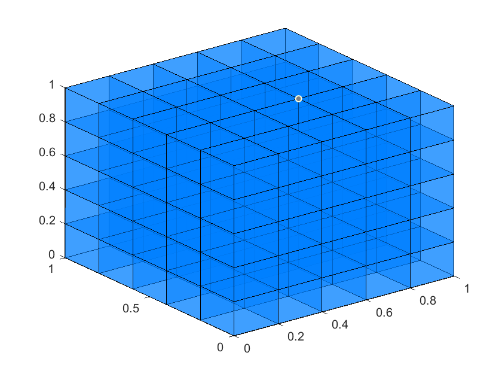
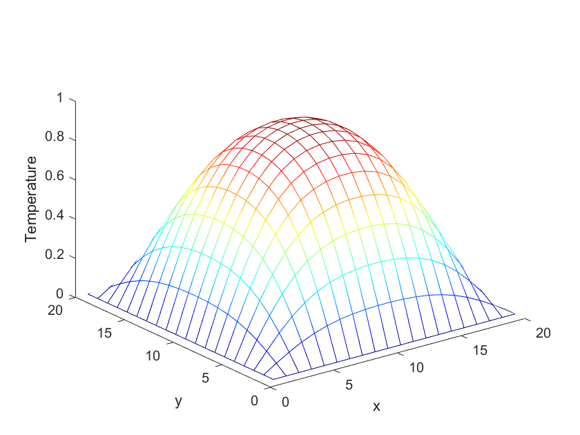
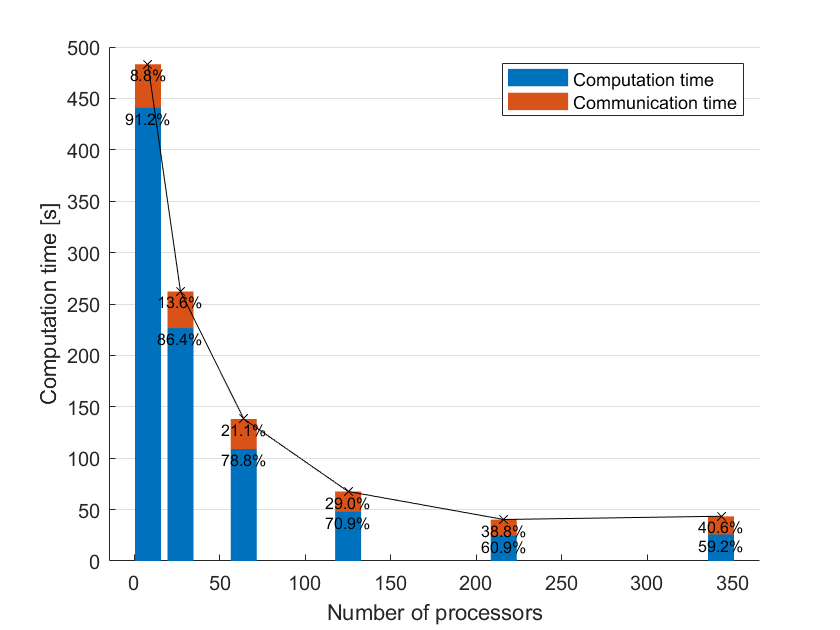
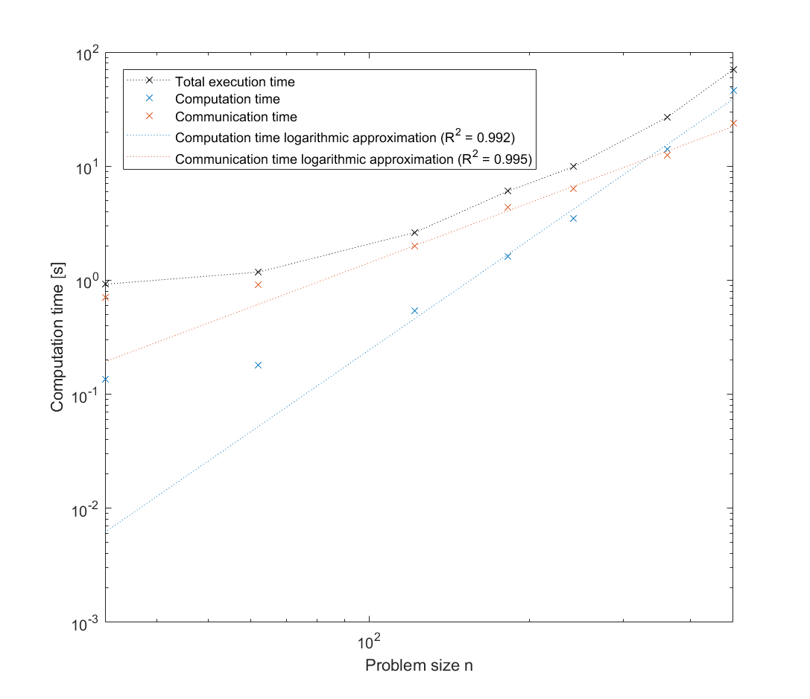

# 3D heat diffusion with MPI

This is a proof of concept to solve the 3D heat equation in a cube of size 1 by 1 by 1 with boundary conditions of constant temperature of 0 on the external faces. The initial value is taken as a temperature of 1 within the cube.

The equation to solve is the following:
$$
\frac{\partial u}{\partial t}=k\left(\frac{\partial^{2} u}{\partial x^{2}}+\frac{\partial^{2} u}{\partial y^{2}}+\frac{\partial^{2} u}{\partial z^{2}}\right)
$$
Time is discretized with an explicit Euler method and space with a second order finite difference scheme, with a time step of $\delta$ and a constant spatial step of $h$. This gives overall:
$$
u[i, j, k, s+1]=(1-6 r) u[i, j, k, s]
+r(u[i+1, j, k, s]+u[i-1, j, k, s]
+u[i, j+1, k, s]+u[i, j-1, k, s]
+u[i, j, k+1, s]+u[i, j, k-1, s])
$$
with $r=\frac{k \delta}{h^{2}}$.

### 1. Parallelization

Because we use a spatial finite difference scheme, the computation for a given grid point depends on the values of the immediate neighboring grid points. For data locality, it is therefore logical to divide the cube in the same number of sub-cubes as the number of processors used for parallelization. For example, if 125 processors are used, the cube is divided into 125 sub-cubes as follow:

Because we use sub-cubes for simplicity, this adds the condition that the number of processors used must be the cube of an integer. The total number of points in the cube must also be dividable by the number of processors.

As the boundaries of the main cube have a fixed temperature, all of the processors compute the following number of values:
$$
\frac{(n-2)^{3}}{n_{proc}}
$$
However, because each point depends on the neighboring points, each sub-cube must have an additional thickness of 1 value on every face, to be able to compute all of the inner values. The size of a sub-cube is therefore:
$$
\sqrt[3]{\frac{(n-2)^{3}}{n_{proc}}}+2
$$
Inside of those sub-cubes, the computations can be run as in a full cube with the external points being boundary conditions. However, after each computation, the boundary conditions must be updated. This is in this step where all of the processors communicate with MPI. For each of the sub-cubes, the external faces of the computes values cubes are sent to the relevant neighboring sub-cubes while the boundary is updated with the data sent from those same cubes. 

This process is repeated until the last iteration. The computations are exactly the same as the ones performed in a sequential program, but are equally divided into $n_{proc}$ number of processors. A slice from the result computed with 27 processors and a cube size of $n=20$ is plotted below as an example.

To check that the computations were performing correctly, the obtained temperature values were compared with those of the sequential algorithm in two cases: with a cube size of 18 and a number of processor of 8 and a cube size of 20 and a number of processor of 27. In both cases, the difference of values was exactly zero with a used precision of $10^{-16}$. This is not surprising as the performed computations are exactly the same, but it confirms that the MPI program performs correctly.

### 2. Execution times on Oakbridge-CX

The implementation was tested on the Supercomputer System of the University of Tokyo Information Technology Center, Oakbridge-CX.

The time of execution is first studied with a problem size fixed at $n=422$  as 420 is a highly divisible number. The execution times (including computing and communication time) are recorded for a number of processors of 8, 27, 64, 125, 216 and 343. The results are plotted below.

We can observe that the computation time decreases with the number of processors before reaching a plateau as the communication times start to increase. For a number of processors of 343, each sub-cube as a length of 60 grid points, and at this point the communication time increases compared from the previous case even though the sub-cubes are smaller. The computation time is also almost constant. At this point, overhead may become non negligible.

When using a fixed number of processors (here 216), the execution time increases with the problem size n, as one could expect. Below the measurements are plotted with a double log scale.

When approximating the values of computation time and communication time (excluding the first two values where the overhead is big), we can see that computation time increases with a coefficient of 3.23 with the problem size (mostly cubic) and communication time increases with a coefficient of 1.75 (mostly quadratic). This is in accordance with what could be expected as the computation scales with the volume of the cube ($n^3$) whereas the communication scales with the surface of the cube ($n^2$).